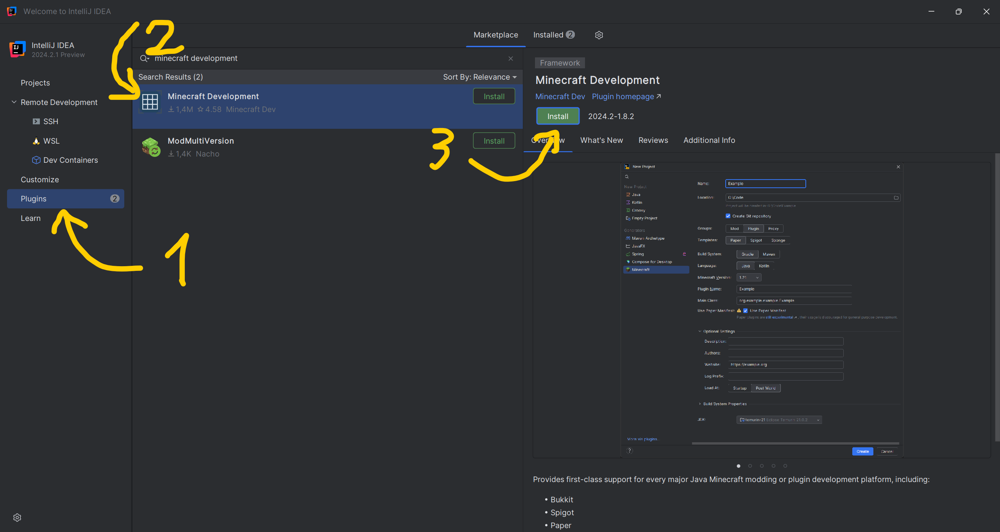
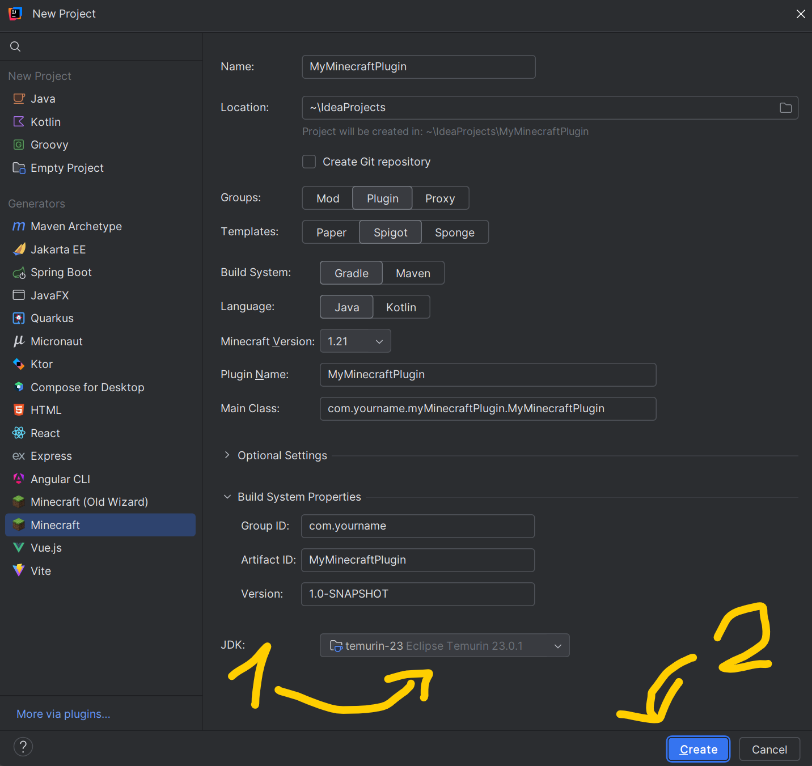
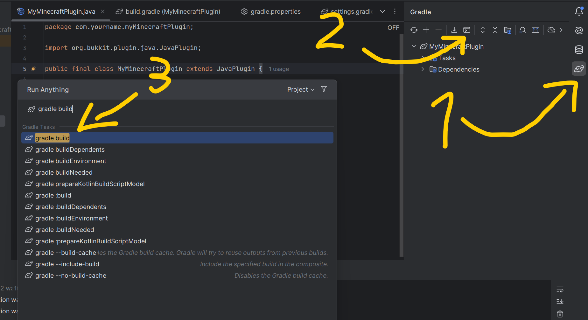

# Minecraft Plugin Development with Gradle

## Chapter One: Setting Up IntelliJ

To get started with Minecraft plugin development, download and install IntelliJ IDEA from [JetBrains](https://www.jetbrains.com/idea/download/). Once installed, open IntelliJ and press on the 'Plugins' button. Then search for 'Minecraft Development' and install the plugin as seen in the screenshot.

Follow the instructions and then restart your IDE

## Chapter Two: Creating the Plugin

### Project Settings

Now, press the 'New Project' button, select the 'Minecraft' Generator,
In the "New Project" window, set the project name to `MyMinecraftPlugin`, choose a suitable location for your project and fill out the other fields. Lastly, download an appropriate jdk as seen in the screenshot. Finally, press create.

Wait a bit until the build process has finished.

## Chapter Three: Main Plugin Class

You will notice a few files who have been created for you, navigate to the main plugin class, usually at src/main/java/com/yourname/myMinecraftPlugin/MyMinecraftPlugin.java
The content should look like this:
```java
package com.yourname.myMinecraftPlugin;

import org.bukkit.plugin.java.JavaPlugin;

public final class MyMinecraftPlugin extends JavaPlugin {

    @Override
    public void onEnable() {
        // Plugin startup logic

    }

    @Override
    public void onDisable() {
        // Plugin shutdown logic
    }
}
```

## Chapter Four: Building the Plugin

To build your plugin, click the gradle icon on the top right, then, click on the terminal icon, type 'gradle build' and run it:

This will generate a JAR file in the `build/libs` directory.

## Chapter Five: Running a Development Server

To test your plugin, you need a Minecraft server. Download Spigot or Paper from their respective websites. Place your JAR file in the `plugins` folder of your server directory.

## Chapter Six: Adding Your First Command

Let's add a simple command to our plugin. In your `plugin.yml`. usually at src/main/resources/plugin.yml, append the following lines:
```yaml
commands:
  hello:
    description: Says hello!
```

Now implement the command in your main class:
```java
@Override
public boolean onCommand(CommandSender sender, Command command, String label, String[] args) {
    if (command.getName().equalsIgnoreCase("hello")) {
        sender.sendMessage("Hello, world!");
        return true;
    }
    return false;
}
```
Dont forget to import the necessary classes at the top of the file:
```java
package com.yourname.myMinecraftPlugin;

import org.bukkit.command.Command;
import org.bukkit.command.CommandSender;
import org.bukkit.plugin.java.JavaPlugin;
```
## Chapter Seven: Using the Logger and Lifecycle Methods

Logging is essential for debugging. Use `getLogger()` to log messages. The `onEnable()` and `onDisable()` methods are called when your plugin is enabled or disabled, respectively.

```java
@Override
public void onEnable() {
    getLogger().info("MyMinecraftPlugin has been enabled!");
}

@Override
public void onDisable() {
    getLogger().info("MyMinecraftPlugin has been disabled!");
}
```

## Chapter Eight: Adding GUIs

Creating GUIs can enhance user experience. Use Bukkit's inventory API to create custom menus:
```java
Inventory inv = Bukkit.createInventory(null, 9, "My GUI");
inv.addItem(new ItemStack(Material.DIAMOND));
player.openInventory(inv);
```
for example in our command:
```java
@Override
public boolean onCommand(CommandSender sender, Command command, String label, String[] args) {
    if (command.getName().equalsIgnoreCase("hello")) {
        sender.sendMessage("Hello, world!");
        
        Inventory inv = Bukkit.createInventory(null, 9, "My GUI");
        inv.addItem(new ItemStack(Material.DIAMOND));
        ((Player) sender).openInventory(inv);
        return true;
    }
    return false;
}
```
Again, dont forget to import the necessary classes at the top of the file:
```java
package com.yourname.myMinecraftPlugin;

import org.bukkit.Bukkit;
import org.bukkit.Material;
import org.bukkit.command.Command;
import org.bukkit.command.CommandSender;
import org.bukkit.entity.Player;
import org.bukkit.inventory.Inventory;
import org.bukkit.inventory.ItemStack;
import org.bukkit.plugin.java.JavaPlugin;
```
## Chapter Nine: Naming Conventions

Follow naming conventions for clarity:
- **Classes**: Use PascalCase (e.g., `MyPluginClass`).
- **Methods**: Use camelCase (e.g., `onEnable`, `handleCommand`).
- **Constants**: Use UPPER_SNAKE_CASE (e.g., `MAX_PLAYERS`).

## Chapter Ten: Configuration Files

To store settings, create a configuration file:
```java
@Override
public void onEnable() {
    saveDefaultConfig(); // Saves config.yml if not present
}
```
Access config values with:
```java
getConfig().getString("someKey");
```

## Chapter Eleven: Event Listeners

Listen for events by implementing `Listener` and registering it:
```java
public class MyListener implements Listener {
    @EventHandler
    public void onPlayerJoin(PlayerJoinEvent event) {
        event.getPlayer().sendMessage("Welcome to the server!");
    }
}
```

Register the listener in `onEnable()`:
```java
getServer().getPluginManager().registerEvents(new MyListener(), this);
```

## Chapter Twelve: Permissions

Manage permissions to control access to commands:
```yaml
permissions:
  myplugin.use:
    description: Allows usage of myplugin commands.
    default: true
```
Check permissions in your command implementation:
```java
if (!sender.hasPermission("myplugin.use")) {
    sender.sendMessage("You do not have permission!");
}
return true;
```

## Chapter Thirteen: Testing Your Plugin

Always test your plugin thoroughly! Join your development server and execute commands to ensure everything works as expected.

## Chapter Fourteen: Conclusion and Next Steps

Congratulations! You've completed this basic Bukkit/Spigot/Paper plugin tutorial using Gradle. From here, explore advanced topics like API integration, custom event handling, and more complex GUIs.